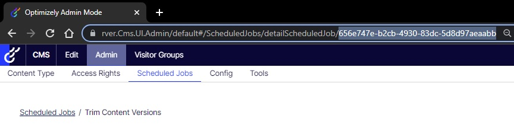
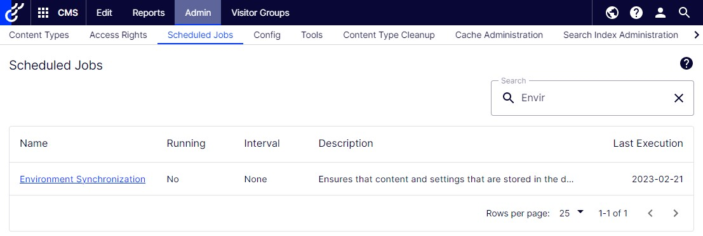
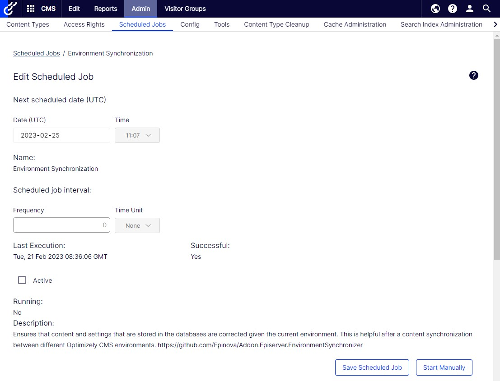
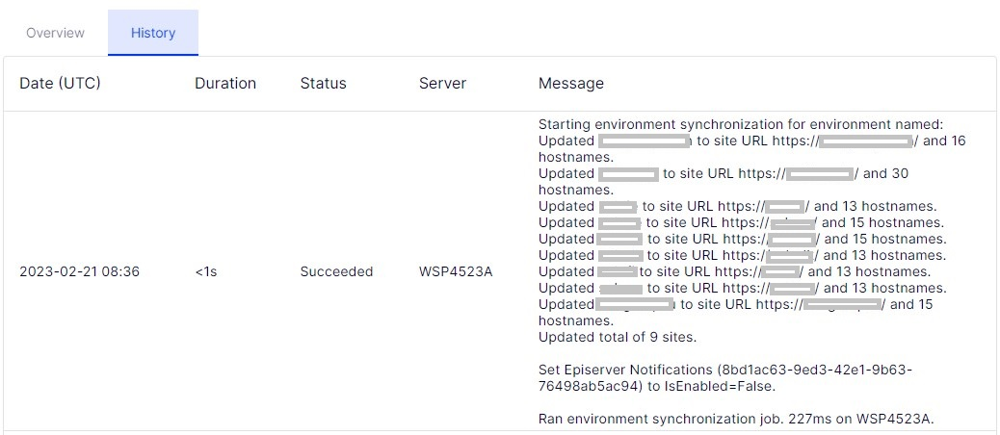

# Optimizely/Episerver CMS Environment Synchronizer
Ensures that content and settings that are stored in the databases are corrected given the current environment. This is helpful after a content synchronization between different Episerver environments.  
When synchronizing databases between environments there might be things that needs to be configured for each environment.
This addon provides the infrastructure to add handlers to handle this, including prebuilt handlers for siteDefinitions and ScheduledJobs that can be configured in configuration files (a.k.a. appSettings.json)
  
The synchronizer can be run as a Startup (see Startup.cs example below), InitializationModule or as a ScheduledJob. It depends on what you think is fitting your environment and project.

## Installation
This packaged will be found as a Nuget package named Addon.Episerver.EnvironmentSynchronizer in the Optiomisely [AKA Episerver] NuGet feed.  [https://nuget.optimizely.com/package/?id=Addon.Episerver.EnvironmentSynchronizer](https://nuget.optimizely.com/package/?id=Addon.Episerver.EnvironmentSynchronizer)  

## Configuration
Example .json  
```json
"EnvironmentSynchronizer": {
    "RunAsInitializationModule": true,
    "RunInitializationModuleEveryStartup": false,
    "SiteDefinitions": [
      {
        "name": "CustomerX",
        "SiteUrl": "https://custxmstr972znb5prep.azurewebsites.net/",
        "ForceLogin": true,
        "Hosts": [
          {
            "Name": "*",
            "UseSecureConnection": false
          },
          {
            "Name": "custxmstr972znb5prep-slot.azurewebsites.net",
            "UseSecureConnection": true,
            "Language": "en"
          },
          {
            "Name": "custxmstr972znb5prep.azurewebsites.net",
            "UseSecureConnection": true,
            "Language": "en",
            "Type": "Primary"
          }
        ],
        "SetRoles": [],
        "RemoveRoles": []
      }
    ],
    "ScheduledJobs": [
      {
        "name": "*",
        "IsEnabled": false
      },
      {
        "name": "YourScheduledJob",
        "IsEnabled": true,
        "AutoRun": true
      }
    ]
  }
```
Startup.cs
```csharp
using Addon.Episerver.EnvironmentSynchronizer.Configuration;
...
namespace [Yournamespace]
{
	public class Startup
	{
		public void ConfigureServices(IServiceCollection services)
		{
            ...
            services.AddCms()
            ... 
            // Add somewhere after AddCms()...
			...
			services.AddEnvironmentSynchronization();
			...
		}
	...
	}
}
```

## Adding custom handlers
You can add custom handlers by creating and registering a class that implements IEnvironmentSynchronizer. 
```csharp
using Addon.Episerver.EnvironmentSynchronizer;
using EPiServer.ServiceLocation;

namespace Yoursite.Infrastructure.Environments
{
    [ServiceConfiguration(typeof(IEnvironmentSynchronizer))]
    public class TestEnvironmentSynchronizer : IEnvironmentSynchronizer
    {
        public string Synchronize(string environmentName)
        {
            //TODO: Do something
        }
    }
}
```
You can return result log from the "Synchronize" method. Example below is a Environment Synchronizer that should remove GDPR data in alla enviroments except production environment.
```csharp
using Addon.Episerver.EnvironmentSynchronizer;
using EPiServer.ServiceLocation;
using System.Text;

namespace Yoursite.Infrastructure.Environments
{
	[ServiceConfiguration(typeof(IEnvironmentSynchronizer))]
	public class GdprEnvironmentSynchronizer : IEnvironmentSynchronizer
	{
		private StringBuilder resultLog = new StringBuilder();
		public string Synchronize(string environmentName)
		{
			if (!EnvironmentHelper.IsProductionEnvironment(environmentName))
			{
				//Add logic to delete/handle GDPR data from application.
				resultLog.AppendLine("Removed GDPR data");
			}
			return resultLog.ToString();
		}
	}
}
```

## About environments
Episerver has many different ways to be hosted. We have added the infrastructure to tell your synchronizers the current environment - but you need to implement the logic for this yourself. For instance:  
```csharp
using Addon.Episerver.EnvironmentSynchronizer;
using EPiServer.ServiceLocation;
using Microsoft.Extensions.Configuration;

namespace Yoursite.Infrastructure.Environments
{
   [ServiceConfiguration(typeof(IEnvironmentNameSource))]
    public class EnvironmentNameSource : IEnvironmentNameSource
    {
        private readonly IConfiguration Configuration;

        public EnvironmentNameSource(IConfiguration configuration)
        {
            Configuration = configuration;
        }

        public string GetCurrentEnvironmentName()
        {
            return Environment.GetEnvironmentVariable("ASPNETCORE_ENVIRONMENT");
        }
    }
}
```
In the example above it loads the setting/configuration value from the environment variables in DXP or IIS.  
```csharp
using Addon.Episerver.EnvironmentSynchronizer;
using EPiServer.ServiceLocation;
using Microsoft.Extensions.Configuration;

namespace Yoursite.Infrastructure.Environments
{
   [ServiceConfiguration(typeof(IEnvironmentNameSource))]
    public class EnvironmentNameSource : IEnvironmentNameSource
    {
        private readonly IConfiguration Configuration;

        public EnvironmentNameSource(IConfiguration configuration)
        {
            Configuration = configuration;
        }

        public string GetCurrentEnvironmentName()
        {
            return Configuration["EnvironmentSettings.Environment"];
        }
    }
}
```
In the example above it loads the setting/configuration value from appsettings.json with the name "EnvironmentSettings.Environment".  
```json
{
  "EnvironmentSettings.Environment": "dev",
}
```
### DXP variable ASPNETCORE_ENVIRONMENT support
If you don´t implement the logic specified above. The DXP variable ´ASPNETCORE_ENVIRONMENT´ will be used. More information about the DXP environments and the appsetting can be found on [https://world.episerver.com/documentation/developer-guides/digital-experience-platform/development-considerations/environment-configurations/](https://world.episerver.com/documentation/developer-guides/digital-experience-platform/development-considerations/environment-configurations/)  
So if you don´t set this variable yourself you will get the following values:  
1. In your local environment: "" (empty value)
2. In the integration environment: "Integration"  
3. In the preproduction environment: "Preproduction"  
4. In the production environment: "Production"  

## Configuration description

### runAsInitializationModule
Tells the synchronizer that you want to run it as an InitializationModule.

### runInitializationModuleEveryStartup
Tells the synchronizer that you will run synchronization with InitializationModule every time the application is starting up. If this is set to `false`, that is default if this attribute is not set. It will check for a flag that tells the synchronizer if it has already synchronized the current environment or not. So it will only run if the flag specifies a value of a environment that is not equal to the current environment. This logic will only be used for the InitializationModule logic. The schedule job will always synchronize.  
This function is implemented for these projects that don´t want the payload of synchronization every time the application starts up.

### sitedefinition
**Id** is the GUID that identify the site. If this is provided it will ignore the "Name" attribute.  
**Name** is the name of the sitedefinition that will be updated. If **Id** is not specified it will match the existing SiteDefinition in the Episerver CMS against this name.  
**SiteUrl*** is the SiteUrl that this site should have/use.
[**ForceLogin***](/Documentation/ForceLogin.md) will remove 'Everyone' AccessLevel.Read if it is found for the site.

### hosts
You need to specify all the hosts that the site needs. When the synchronizer is updating a SiteDefinition it will expect that you have specified all hostnames. So of you in Episerver CMS has a extra host that is not specified in the web.config it will be removed.

### host
**Name** is the hostname. Example local.alloydemo.se  
**UseSecureConnection** specify if it is a http/https URL.  
**Type** is the type of the host. It is the enum EPiServer.Web.HostDefinitionType that are used by Episerver CMS. If the Type is not specified it will be set to `Undefined`.  
Options (`EPiServer.Web.HostDefinitionType [Enum]`):  
- **Undefined**
- **Edit**
- **Primary**
- **RedirectPermanent**
- **RedirectTemporary**
**Language** is the CultureInfo that is related to the hostname  

### SetRoles
Can contain a list of roles that will be added/updated. If not exist in existing list it will be added. If it exist, the AccessLevel will be updated with the 
access level you specified in the configuration. Note: The permission will be set on startpage of the site and all childpages.  
```json
"EnvironmentSynchronizerOptions": {
    ...
    "SiteDefinitions": [
      {
        ...
        "SetRoles": [
            {
                "Name": "CmsAdmins",
                "Access": [
                    "FullAccess"
                ]
            },
            {
                "Name": "CmsEditors",
                "Access": [
                    "Read",
                    "Create",
                    "Edit",
                    "Delete",
                    "Publish"
                ]
            }
        ],
        ...
      }
    ]
    ...
  }
```
**Name** is the name of the role. Example CmsEditors  
**Access** is the AccessLevel that should be set for the role. It is the enum EPiServer.Security.AccessLevel that are used by Episerver CMS. If the Access is not specified it will be set to `NoAccess`.  
Options (`EPiServer.Security.AccessLevel [Enum]`):  
- **NoAccess** No access to an item
- **Read** Read access to an item
- **Create** Create access for an item, i e create new items below this item
- **Edit** Change / create new versions of this item
- **Delete** Delete this item
- **Publish** Publish/unpublish items and versions of an item
- **Administer** Set access rights for an item
- **FullAccess** Full access for an item

### RemoveRoles
Can contain a list of roles that will be removed. If role exist, the role will be removed from the site (No access). Note: The permission will be set on startpage of the site and all childpages.  
```json
"EnvironmentSynchronizerOptions": {
    ...
    "SiteDefinitions": [
      {
        ...
        "RemoveRoles": [
            "CmsAdmins",
            "Everyone"
        ],
        ...
      }
    ]
    ...
  }
```
**Name** is the name of the role. Example CmsEditors  

## scheduledjobs
You can specify 0 to many Scheduledjob that should be updated.

### schedulejob
**Id**: If Id is specified then the synchronizer will ignore the Name and find the scheduled job that match the Id.   
The Id is GUID for the ScheduleJob. To get the GUID for the schedule job in the database, you can look in the tblScheduleItem table and find it there. If you don´t have access to the database, you can go to the schedule job page in the Episerver administration interface. 
Click on an schedule job and look on the URL. You can copy the GUID from there.  
  
**Name**: The name of the job that you want to update. You can use `*` as a wildcard. That means that it will go through all ScheduledJobs in Episerver CMS and enabled/disabled them. So you should have this as the first definition in the configuration.  
*Note 1: The **Name** field is required to specify in the XML. But the environment synchronizer will only try to match this value if the Id field is empty. And the value can be empty.*   
*Note 2: The name of the schedule job is not always the same as you can see in the administration interface. I had problem to find the right schedule job because I wrote the english name of the task. And after alot of scratching my head I realized that the names on the schedule jobs where in swedish in the database. So using Id is recommended.*  
Example 1:  
```json
    "ScheduledJobs": [
      {
        "Id": "*",
        "Name": "*",
        "IsEnabled": false
      },
      {
        "Name": "Episerver-notification",
        "IsEnabled": true
      }
    ]
  "Note": "In this example it first go through all ScheduledJobs and disable them. And then it will enable the job 'Episerver-notification'."
```  
Example 2:  
```json
    "ScheduledJobs": [
      {
        "Id": "*",
        "Name": "*",
        "IsEnabled": false
      },
      {
        "Id": "a42f6137-0bcf-4a88-bbd3-0ef219b7eafa"
        "Name": "Empty trashcan",
        "IsEnabled": false,
        "AutoRun": true
      }
    ]
    "Note": "In this example it first go through all ScheduledJobs and disable them. And then it will enable the job 'Empty trashcan' and run the schedule job."
```
**IsEnabled** [bool] set if the job should be enabled/disabled. 

**AutoRun** [bool] set if the job should be executed on change of environment. This is an optional attribute that, then not supplied will default to false.  
If used with a wildcard then the attribute is ignored.

## Run as ScheduleJob
When Addon.Episerver.EnvironmentSynchronizer is installed you can start synchronization manually at any time by run a schedule job. The schedule job is "Environment Synchronization" and can 
be found in the list of schedule jobs in administration interface of you Optimizely/Episerver CMS.  
  
If you clik on the schedule job and open up the information page. You can click on the "Start Manually" button to start synchronization.  
  
After the schronization is done. Click on the "History" tab and see the result.  
  