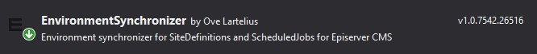
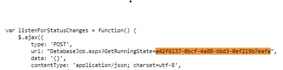

# Episerver CMS Environment Synchronizer
Ensures that content and settings that are stored in the databases are corrected given the current environment. This is helpful after a content synchronization between different Episerver environments.  
When synchronizing databases between environments there might be things that needs to be configured for each environment.
This addon provides the infrastructure to add handlers to handle this, including prebuilt handlers for siteDefinitions and ScheduledJobs that can be configured in configuration files (a.k.a. web.config)
  
The synchronizer can be run as a InitializationModule or as a ScheduledJob. It depends on what you think is fitting your environment and project.

## Installation
This will be packaged as a Nuget package named Addon.Episerver.EnvironmentSynchronizer and put in Episervers Nuget feed once tested a bit more.  


## Configuration
Example web.config
```xml
<configuration>
  <configSections>
    <section name="env.synchronizer" type="Addon.Episerver.EnvironmentSynchronizer.Configuration.SynchronizerSection" allowLocation="true" allowDefinition="Everywhere" />
  </configSections>
	<env.synchronizer runAsInitializationModule="true" runInitializationModuleEveryStartup="false">
		<sitedefinitions>
			<sitedefinition Id="" Name="CustomerX" SiteUrl="https://custxmstr972znb5prep.azurewebsites.net/">
				<hosts>
					<host Name="*" UseSecureConnection="false" Language="" />
					<host Name="custxmstr972znb5prep-slot.azurewebsites.net" UseSecureConnection="true" Language="en" />
				</hosts>
			</sitedefinition>
		</sitedefinitions>
		<scheduledjobs>
			<scheduledjob Id="*" Name="*" IsEnabled="false" />
			<scheduledjob Name="YourScheduledJob" IsEnabled="true" />
		</scheduledjobs>
	</env.synchronizer>
```

## Adding custom handlers
You can add custom handlers by creating and registering a class that implements IEnvironmentSynchronizer
```csharp
using Addon.Episerver.EnvironmentSynchronizer;
using EPiServer.ServiceLocation;

namespace Yoursite.Infrastructure.Environments
{
    [ServiceConfiguration(typeof(IEnvironmentSynchronizer))]
    public class TestEnvironmentSynchronizer : IEnvironmentSynchronizer
    {
        public string Synchronize(string environmentName)
        {
            //TODO: Do something
        }
    }
}
```

## About environments
Episerver has many different ways to be hosted. We have added the infrastructure to tell your synchronizers the current environment - but you need to implement the logic for this yourself. For instance:

```csharp  
using Addon.Episerver.EnvironmentSynchronizer;
using EPiServer.ServiceLocation;
using System.Configuration;

namespace Yoursite.Infrastructure.Environments
{
    [ServiceConfiguration(typeof(IEnvironmentNameSource))]
    public class SiteEnvironmentNameSource : IEnvironmentNameSource
    {
        public string GetCurrentEnvironmentName()
        {
            return ConfigurationManager.AppSettings["EnvironmentName"];
        }
    }
}
``` 
### DXP variable episerver:EnvironmentName support
If you don´t implement the logic specified above. The DXP variable ´episerver:EnvironmentName´ will be used. More information about the DXP environments and the appsetting can be found on [https://world.episerver.com/documentation/developer-guides/digital-experience-platform/development-considerations/environment-configurations/](https://world.episerver.com/documentation/developer-guides/digital-experience-platform/development-considerations/environment-configurations/)  
So if you don´t set this variable yourself you will get the following values:  
1. In your local environment: "" (empty value)
2. In the integration environment: "Integration"  
3. In the preproduction environment: "Preproduction"  
4. In the production environment: "Production"  

### runAsInitializationModule
Tells the synchronizer that you want to run it as an InitializationModule.

### runInitializationModuleEveryStartup
Tells the synchronizer that you will run synchronization with InitializationModule every time the application is starting up. If this is set to `false`, that is default if this attribute is not set. It will check for a flag that tells the synchronizer if it has already synchronized the current environment or not. So it will only run if the flag specifies a value of a environment that is not equal to the current environment. This logic will only be used for the InitializationModule logic. The schedule job will always synchronize.  
This function is implemented for these projects that don´t want the payload of synchronization every time the application starts up.

### sitedefinition
**Id** is the GUID that identify the site. If this is provided it will ignore the "Name" attribute.  
**Name** is the name of the sitedefinition that will be updated. If **Id** is not specified it will match the existing SiteDefinition in the Episerver CMS against this name.  
**SiteUrl*** is the SiteUrl that this site should have/use.  

### hosts
You need to specify all the hosts that the site needs. When the synchronizer is updating a SiteDefinition it will expect that you have specified all hostnames. So of you in Episerver CMS has a extra host that is not specified in the web.config it will be removed.

### host
**Name** is the hostname. Example local.alloydemo.se  
**UseSecureConnection** specify if it is a http/https URL.  
**Type** is the type of the host. It is the enum EPiServer.Web.HostDefinitionType that are used by Episerver CMS. If the Type is not specified it will be set to `Undefined`.  
Options (`EPiServer.Web.HostDefinitionType [Enum]`):  
- **Undefined**
- **Edit**
- **Primary**
- **RedirectPermanent**
- **RedirectTemporary**
**Language** is the CultureInfo that is related to the hostname  

## scheduledjobs
You can specify 0 to many Scheduledjob that should be updated.

### schedulejob
**Id**: If Id is specified then the synchronizer will ignore the Name and find the scheduled job that match the Id.   
The Id is GUID for the ScheduleJob. To get the GUID for the schedule job in the database, you can look in the tblScheduleItem table and find it there. If you don´t have access to the database, you can go to the schedule job page in the Episerver administration interface. Right click with the mouse on the page and select "Show framesource". In the HTML you can search for "GetRunningState". Then you will see the schedule job GUID like to image below.  
  
**Name**: The name of the job that you want to update. You can use `*` as a wildcard. That means that it will go through all ScheduledJobs in Episerver CMS and enabled/disabled them. So you should have this as the first definition in the configuration.  
*Note 1: The **Name** field is required to specify in the XML. But the environment synchronizer will only try to match this value if the Id field is empty. And the value can be empty.*   
*Note 2: The name of the schedule job is not always the same as you can see in the administration interface. I had problem to find the right schedule job because I wrote the english name of the task. And after alot of scratching my head I realized that the names on the schedule jobs where in swedish in the database. So using Id is recommended.*  
Example 1:  
```xml
  <schedulejobs>
    <schedulejob Id="*" Name="*" IsEnabled="false" />
    <schedulejob Name="Episerver-notification" IsEnabled="true" />
  </schedulejobs>
  <!-- In this example it first go through all ScheduledJobs and disable them.  
  And then it will enable the job "Episerver-notification". -->
```  
Example 2:  
```xml
  <schedulejobs>
    <schedulejob Id="*" Name="*" IsEnabled="false" />
    <schedulejob Id="a42f6137-0bcf-4a88-bbd3-0ef219b7eafa" Name="Empty trashcan" IsEnabled="true" />
  </schedulejobs>
  <!-- In this example it first go through all ScheduledJobs and disable them.  
  And then it will enable the job "Episerver-notification". -->
```
**IsEnabled** [bool] set if the job should be enabled/disabled. 
