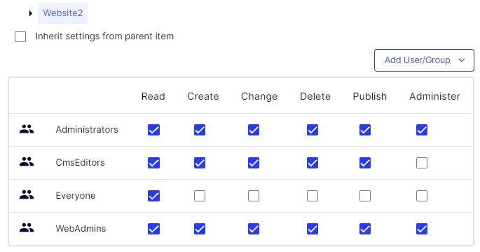
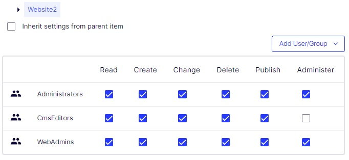

# ForceLogin
ForceLogin is a function that very simple remove the access for anonymous user group "Everyone" on the site where this is set to 'true'. It does not matter what AccessLevel the user group had. It will be simple removed.  
Note: The changes for all user groups are saved with "ReplaceChildPermissions" from start page lever for the site. That means that specific permissions on a specific webpage will be lost.
  
[<= Back](../README.md)

appsettings.json example to use ForeLogin on website "Website2".  
```json
"EnvironmentSynchronizer": {
    "RunAsInitializationModule": true,
    "RunInitializationModuleEveryStartup": false,
    "SiteDefinitions": [
      {
        "name": "Website1",
        "SiteUrl": "https://website1.com/",
        "ForceLogin": false,
        "Hosts": [
          {
            "Name": "*",
            "UseSecureConnection": true
          },
          {
            "Name": "website1.com",
            "UseSecureConnection": true,
            "Language": "en"
          }
        ]
      },
      {
        "name": "Website2",
        "SiteUrl": "https://website2.com/",
        "ForceLogin": true,
        "Hosts": [
          {
            "Name": "website2.com",
            "UseSecureConnection": true,
            "Language": "en"
          }
        ]
      }
    ],
    "ScheduledJobs": []
  }
```

Before user group 'Everyone' is removed.  
  
After user group 'Everyone' is removed.  
  
Message in log.  


[<= Back](../README.md)
