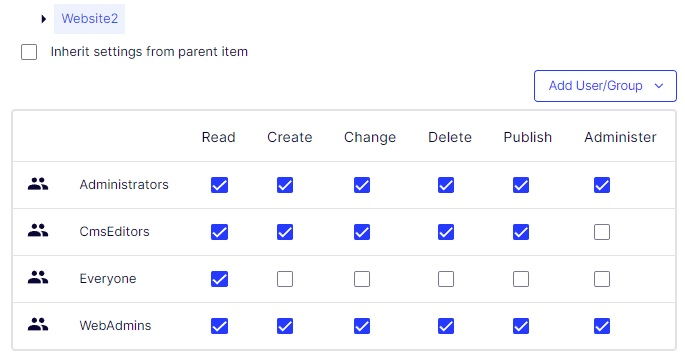
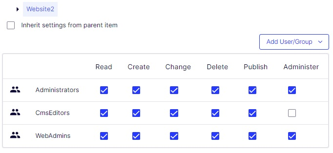

# ForceLogin
ForceLogin is a function that removes access for the anonymous user group "Everyone" on the application where this is set to `true`. It does not matter what AccessLevel the user group had. It will be removed.  
Note: The changes for all user groups are saved with "ReplaceChildPermissions" from the application entry point. That means that specific permissions on a specific webpage will be lost.
  
[<= Back](../README.md)

appsettings.json example to use ForeLogin on website "Website2".  
```json
"EnvironmentSynchronizer": {
    "RunAsInitializationModule": true,
    "RunInitializationModuleEveryStartup": false,
    "SiteDefinitions": [
      {
        "Name": "Website1",
        "ForceLogin": false,
        "Hosts": [
          {
            "Name": "*",
            "UseSecureConnection": true
          },
          {
            "Name": "website1.com",
            "UseSecureConnection": true,
            "Language": "en"
          }
        ]
      },
      {
        "Name": "Website2",
        "ForceLogin": true,
        "Hosts": [
          {
            "Name": "website2.com",
            "UseSecureConnection": true,
            "Language": "en"
          }
        ]
      }
    ],
    "ScheduledJobs": []
  }
```

Before user group 'Everyone' is removed.  
  
After user group 'Everyone' is removed.  
  
Message in log.  


[<= Back](../README.md)
